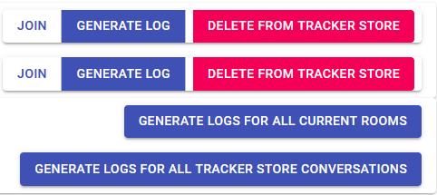

# Web User-interface Guide

### Login

At login step user needs to enter user name as follows.

After user name login user needs to select to which chat-room user wants to enter. This is done by selecting room from drop-down menu as follows.

### Chat

After entering the chat-room we can see all participants in the room.

Now we can start chat by writing into message field as follows. You may send message either with enter or by pressing ”SEND”-button.

After greeting chat-bot replies as follows.

You may leave room by pressing ”LOGOUT” on the top left-hand corner

### Admin

You can enter into admin features by giving ”Admin” as user name in login view.

After entering chat-room you have possibility to enter into admin features view by pressing ”ADMIN” on top view.

In admin view user can create new rooms and select bot type (Normal/Troll) for created room.

When ”CREATE”-button is pressed list of existing rooms is updated.

Web GUI logger functionality

The Web User Interface features a limited version of the command line logger functionality. Working requires TRACKER_STORE_URL .env variable value to match the tracker store url used in the Rasa `endpoints.yml` file.

**GENERATE LOG** button fetches the corresponding conversation history from Rasa's tracker store database and creates a csv log of it in the `logs` folder.

**DELETE FROM TRACKER STORE** deletes the corresponding conversation history from Rasa's tracker store database. 

Note: Joining a room after conversation history deletion starts a new conversation which is saved in the tracker store under the same name. The old chat messages are still displayed in the room until Trollbot server is restarted, but have no effect on the bot's behavior.

*WARNING!* Once deleted from the tracker store, the conversation history cannot be recovered. Only click if:

a) The room is used for testing where storing the history is irrelevant.

or

b) A backup has been made of the MongoDB tracker store conversation document.

**GENERATE LOGS FOR ALL CURRENT ROOM** same as **GENERATE LOG** but for all rooms on the list.

**GENERATE LOGS FOR ALL TRACKER STORE CONVERSATIONS** Same as the above but includes conversation histories for the rooms used during previous server runs. 
