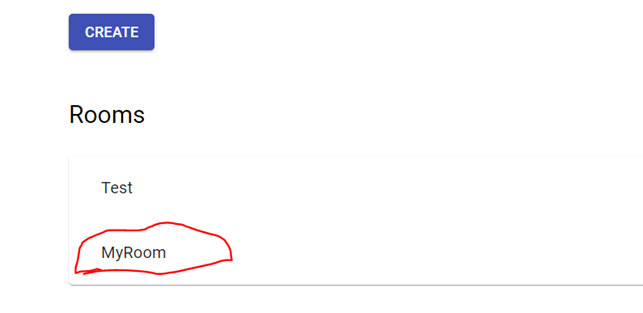

# Web User-interface Guide

### Login

At login step user needs to enter user name as follows.

After user name login user needs to select to which chat-room user wants to enter. This is done by selecting room from drop-down menu as follows.

### Chat

After entering the chat-room we can see all participants in the room.

Now we can start chat by writing into message field as follows. You may send message either with enter or by pressing ”SEND”-button.

After greeting chat-bot replies as follows.

You may leave room by pressing ”LOGOUT” on the top left-hand corner

### Admin

You can enter into admin features by giving ”Admin” as user name in login view.

After entering chat-room you have possibility to enter into admin features view by pressing ”ADMIN” on top view.

In admin view user can create new rooms and select bot type (Normal/Troll) for created room.

When ”CREATE”-button is pressed list of existing rooms is updated.

